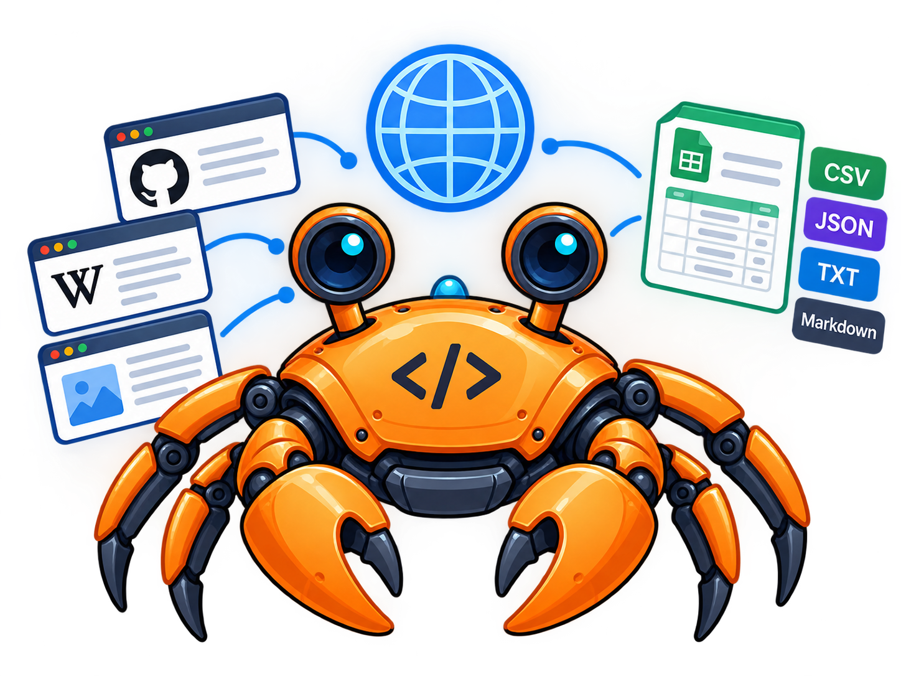

<div align="center">



# 🦀 GitHub Code Crawler

**A configuration-driven, resumable Python source crawler for building high-quality code datasets from GitHub.**

</div>

---

A configuration-driven, resumable Python source crawler that discovers GitHub repositories, samples a diverse repository set, validates and cleans Python code, scans for secrets, deduplicates it, and produces JSONL suitable for code-LLM training.


# GitHub Code Crawler

A configuration-driven, resumable Python source crawler that discovers GitHub repositories, samples a diverse repository set, validates and cleans Python code, scans for secrets, deduplicates it, and produces JSONL suitable for code-LLM training.

## Design goal

The crawler is intentionally **not** a "top GitHub repositories downloader".

A normal run works like this:

```text
configured search queries
        ↓
paginated candidate pool
        ↓
repository quality/license filters
        ↓
remove repositories already completed in previous runs
        ↓
query-group sampling + star-band sampling
        ↓
selected repositories
        ↓
Python file discovery
        ↓
cleaning + syntax/quality checks
        ↓
secret scanning
        ↓
exact + optional structural deduplication
        ↓
repository-level train/validation split
        ↓
train.jsonl / validation.jsonl
```

This means repeated runs can expand the corpus instead of repeatedly crawling the same popular repositories, as long as `output.mode: append` and the persistent state database are retained.

## Project layout

```text
github-code-crawler/
├── main.py
├── config.yaml
├── pyproject.toml
├── requirements.txt
├── .env.example
│
├── src/github_code_crawler/
│   ├── cli.py
│   ├── config.py
│   ├── github_client.py
│   ├── repository.py
│   ├── code_processing.py
│   ├── security.py
│   ├── sampler.py
│   ├── state.py
│   ├── dataset.py
│   ├── pipeline.py
│   └── logging_utils.py
│
└── tests/
```

Each module has one main responsibility, which makes failures easier to isolate and test.

## Installation

```powershell
python -m venv .venv
.venv\Scripts\activate
pip install -e .
```

Copy `.env.example` to `.env` and add your GitHub token:

```text
GITHUB_TOKEN=github_pat_...
```

Do not commit `.env`.

## Test configuration

```powershell
python main.py --dry-run
```

Preview the actual repository selection without downloading source code:

```powershell
python main.py --preview
```

This is useful before a large crawl: it shows the selected repositories, star counts, licenses, and query groups.

## Build a dataset

```powershell
python main.py
```

The command is equivalent to:

```powershell
python -m github_code_crawler
```

when the package is installed in editable mode.

## Diversity and repeated runs

The most important settings are:

```yaml
github:
  queries:
    - name: general
      query: "language:python stars:>=100 archived:false fork:false"
      weight: 0.45
    - name: machine_learning
      query: "language:python topic:machine-learning stars:>=100 archived:false fork:false"
      weight: 0.15

  max_repositories: 300
  max_pages_per_query: 3

sampling:
  strategy: stratified
  repositories_per_run: 100
  candidate_pool_size: 1500
  avoid_previously_crawled: true
```

The crawler:

1. searches all configured query groups,
2. keeps a persistent page position for each query,
3. stores discovered repositories in SQLite so unselected candidates survive to later runs,
4. merges duplicate repository hits,
5. filters repositories,
6. removes repositories already marked `crawled` in the state database,
7. allocates selections across query groups using their weights,
8. samples across star bands within each group.

For example, with `max_pages_per_query: 3`, the first run can discover pages 1-3, the next run pages 4-6, and so on until a query is exhausted. Unselected repositories from earlier pages remain available for later sampling. This prevents the crawler from restarting at the same top repositories on every run.

### Search coverage vs selection

`github.max_repositories` controls how many candidates can be collected **per search query**. `sampling.repositories_per_run` controls how many repositories are actually crawled.

For example:

```text
6 query groups × 300 candidates
             ↓
       candidate pool
             ↓
     select 100 repos
             ↓
        crawl 100
```

Multiple search queries are useful when you want domain diversity. The general query can be kept broad, while other queries target domains such as machine learning, web development, automation, scientific computing, and data science.

## Sampling strategies

```yaml
sampling:
  strategy: stratified
```

Supported strategies:

- `top`: highest-star repositories first.
- `random`: random repositories from the candidate pool.
- `stratified`: query-group allocation plus random sampling inside configurable star bands.

For dataset building, `stratified` is the recommended default.

## Persistent state

The crawler stores state in:

```text
run/state.sqlite3
```

It tracks:

- repositories already completed,
- repositories currently being processed,
- failed repositories,
- exact code hashes,
- structural code hashes.

This gives append runs memory across process restarts.

If a run is interrupted while processing a repository, the next startup recovers repositories left in `processing` state.

## Output modes

### Append mode

```yaml
output:
  mode: append
```

This is recommended for building a large corpus over multiple runs.

The crawler keeps the existing JSONL files and uses `state.sqlite3` to avoid re-crawling completed repositories and previously seen code hashes.

Keep these together:

```text
data/train.jsonl
data/validation.jsonl
data/manifest.jsonl
run/state.sqlite3
```

If you delete the JSONL files but keep the state database, the crawler will intentionally not regenerate already indexed examples.

### Overwrite mode

```yaml
output:
  mode: overwrite
```

This clears the three JSONL output files and resets the persistent crawl state before starting a fresh build.

## Output format

### Training data

`data/train.jsonl` contains records such as:

```json
{"text": "def hello():\n    return 'world'"}
```

This keeps the crawler model-independent. Tokenization should happen later using the tokenizer for the model you actually plan to train.

### Validation data

`data/validation.jsonl` uses the configured validation ratio.

The split is deterministic and repository-based, which reduces train/validation leakage from the same repository.

### Manifest

`data/manifest.jsonl` stores provenance and quality metadata without duplicating the source text.

Example fields include:

```text
repository
file_path
branch
tree_sha
file_sha
license
stars
source_url
exact_hash
structural_hash
characters
non_empty_lines
tokens
split
```

## Data quality and security

The pipeline can:

- ignore vendored/build/cache directories,
- enforce per-file size limits,
- normalize line endings and whitespace,
- reject empty/tiny files,
- reject overly repetitive files,
- reject generated-code markers,
- validate Python syntax,
- count Python tokens,
- scan for potential secrets,
- perform exact deduplication,
- optionally perform conservative structural deduplication.

Secret scanning is heuristic-based and should not be treated as a guarantee that every secret is detected.

The license allowlist is also an initial screening mechanism, not a legal determination that every source file is suitable for every downstream use.

## Rate limits and API behavior

The crawler uses a persistent `requests.Session`, authenticated requests when `GITHUB_TOKEN` is present, retries transient failures, respects rate-limit/reset signals, paginates repository search, and falls back to subtree traversal if the Git tree endpoint reports a truncated recursive result.

GitHub documents a primary authenticated REST limit of 5,000 requests/hour for a personal access token, while search endpoints have stricter limits and GitHub also enforces secondary limits. The crawler therefore avoids uncontrolled concurrency and includes retry/backoff behavior. See the official GitHub API documentation for current limits and best practices.

## Scaling example

For an initial test:

```yaml
github:
  max_repositories: 50
  max_pages_per_query: 1

sampling:
  repositories_per_run: 10

runtime:
  max_files_per_repository: 20
  max_output_records: 500
```

For a larger multi-run corpus:

```yaml
github:
  max_repositories: 300
  max_pages_per_query: 3

sampling:
  repositories_per_run: 100
  candidate_pool_size: 1500

runtime:
  max_files_per_repository: 0
  max_output_records: 0
```

Start small, inspect `run/crawler.log` and `run/stats.json`, then increase the limits.

## Open-source notes

Before publishing your fork/repository publicly:

- choose a license for this crawler itself,
- keep GitHub token credentials out of the repository,
- document the source-code licensing policy you use for datasets,
- preserve provenance in the manifest,
- document the exact configuration used to produce any released dataset.

The license of the crawler is separate from the licenses of source code collected by it.

## Tests

```powershell
pip install -e ".[dev]"
pytest
```

You can also run:

```powershell
python -m compileall -q src tests
```
